# ◆ `Advanced Scale` tool - V 1.01

> Advanced Scale is a bounding box scaling tool for the Unreal Editor

 

## ◆ `Installation`

> 1. Install the plugin to your project
> 2. Enable Advanced Scale in the plugin list
>
> 

>   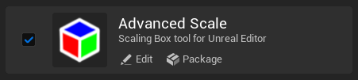
> 

 

## ◆ `Turn on Tool`

> Press `Alt+T` (default) or click the three-color button at the top of the viewport. The button position depends on the Unreal Engine version
>
> 

>   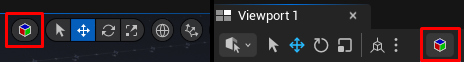
> 

&nbsp;
 

## ◆ `Advanced Scale usage`

<blockquote>

### 1. Hotkeys

> - `Alt+T` - Turn Advanced Scale on
> - `Ctrl` - Hold `Ctrl` to enable Edge/Corner Handles
> - `Shift` - Hold `Shift` while dragging a handle to scale uniformly
> - `Alt` - Hold `Alt` while dragging a handle to scale from both sides
> - `V` - Hold `V` while dragging a handle to enable vertex snapping

&nbsp;

### 2. Menu

> By default, the menu is located in the lower left corner of the viewport
>
> 

>   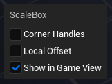
> 

>
> - Corner Handles - Turn on Corner and Edge handles
> - Show in Game View - Display bounding box of Advanced Scale tool in Game View mode

 

### 3. Face Handles

> **`Face Handles`** are located at the center of each face. Drag a handle to scale the selection along a single axis while the opposite face remains fixed
>
> 

>   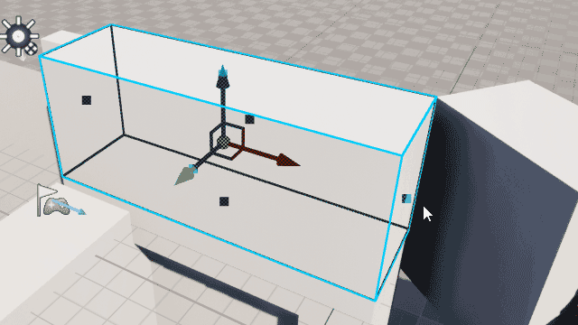
>   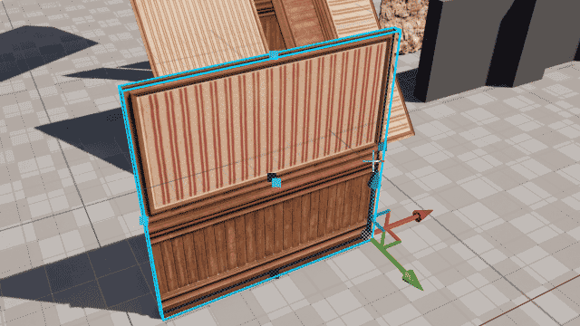
> 

 

### 4. Edge/Corner Handles

> To activate Edge/Corner handles, hold `Ctrl` or select the `Corner Handles` checkbox from the menu at the bottom left. Hover your mouse over the place where the handle should be
>
> 

>   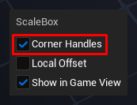
>   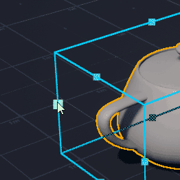
> 

>
> - #### Edge Handles
> `Edge Handles` are located on the edges of the bounding box. Drag a handle to scale the selection along two axes simultaneously while keeping the opposite edges fixed
>
> 

>   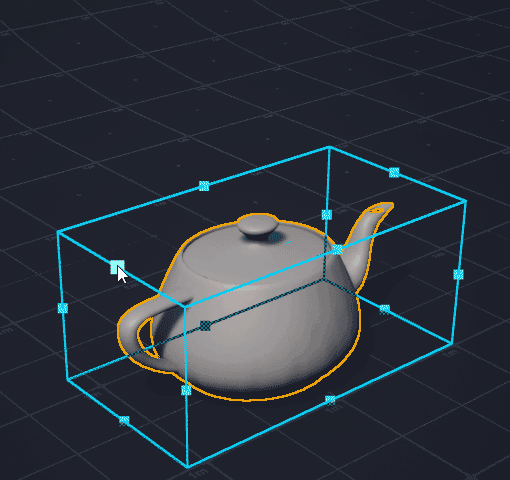
>   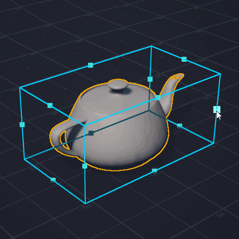
> 

>
> - #### Corner Handles
> `Corner Handles` are located at the corners of the bounding box. Drag a handle to scale the selection along all relevant axes while keeping the opposite corner fixed
>
> 

>   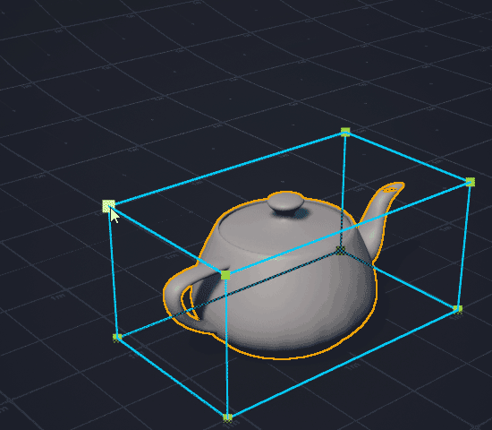
> 

 

### 5. Flat Mode
> - #### Planar objects
> When a flat object is selected, `Flat Mode` is activated. `Face Handles` are displayed only on four sides. `Corner Handles` are displayed in corners
> 
> 

>   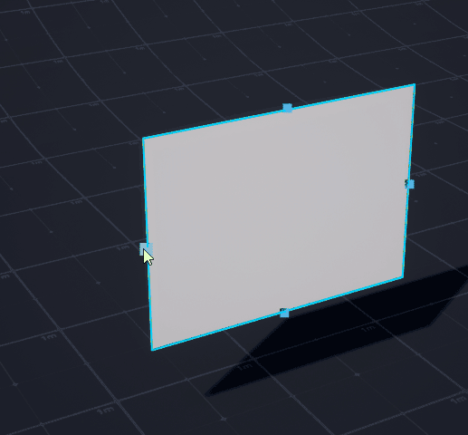
> 

>
> - #### Flattened object
> When an object is flattened to a certain thickness (specified in the plugin settings), `Flat Mode` is activated for `Corner Handles`
>
> 

>   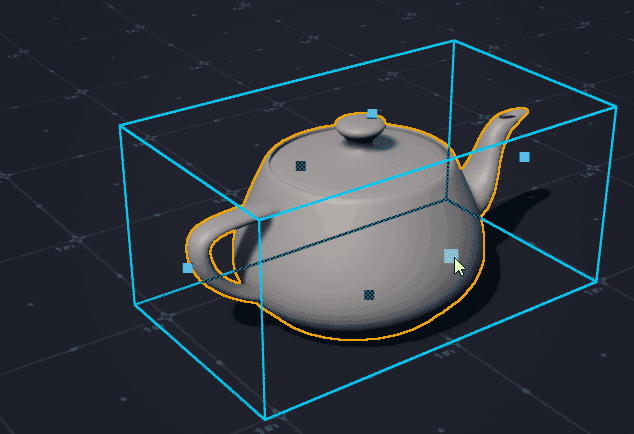
> 

 

### 6. Hotkeys usage
> - #### Uniform Scale
> Hold `Shift` while dragging a handle to scale uniformly
>
> 

>   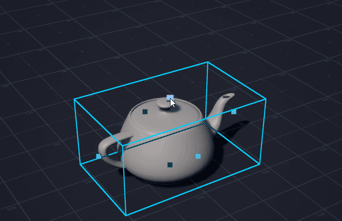
> 

>
> - #### 2-Side Scale
> Hold `Alt` while dragging a handle to scale from both sides
>
> 

>   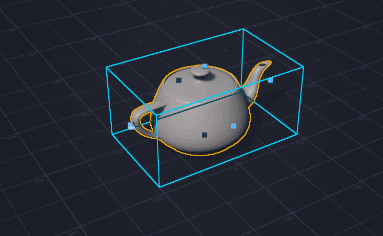
> 

>
> - #### Vertex snapping
> Hold `V` while dragging a handle to enable vertex snapping. Drag the mouse to the object you want to align with, even if it is far away. Works for handles on sides, edges and corners
>
> 

>   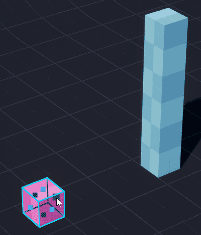
>   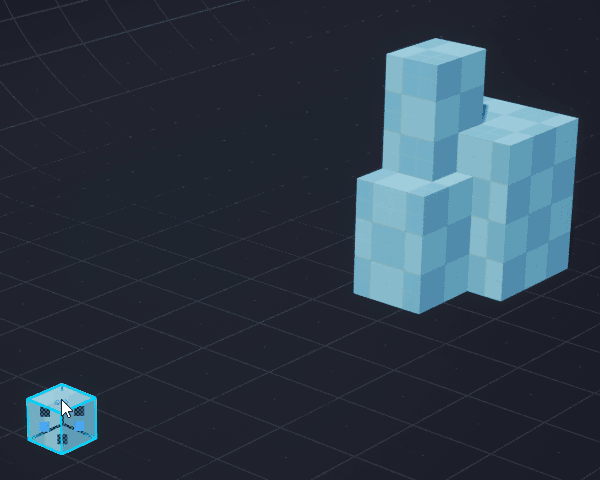
> 

 

> ### 7. Grid snapping
> Enable `Snapping to the grid` for dragging
> 

>   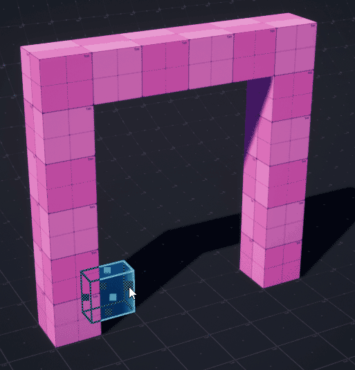
> 

 

### 8. Multi objects $\color{red}{\text{(see the Limitations section for limitations)}}$
> Advanced Scale supports scaling multiple objects simultaneously, including those that are rotated relative to each other
> - #### Several objects are rotated in 90 degree increments relative to each other
>
> 

>   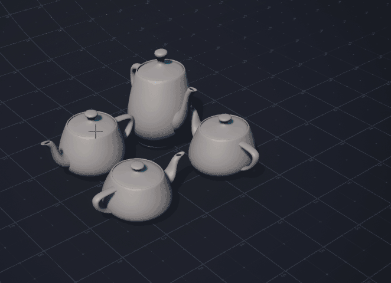
>   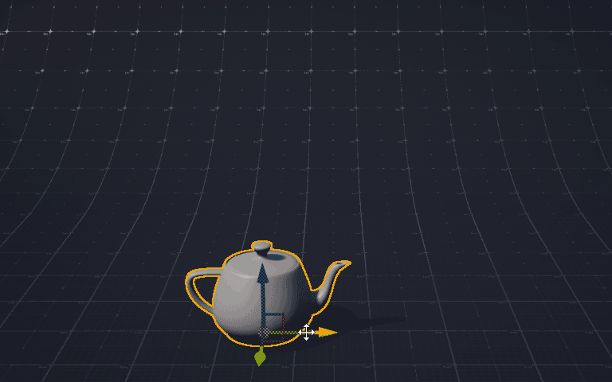
> 

>
> - #### Multiple objects rotated at an arbitrary angle.
> When moving the handles, objects are scaled along local axes and shifted relative to the bounding box
>
> 

>   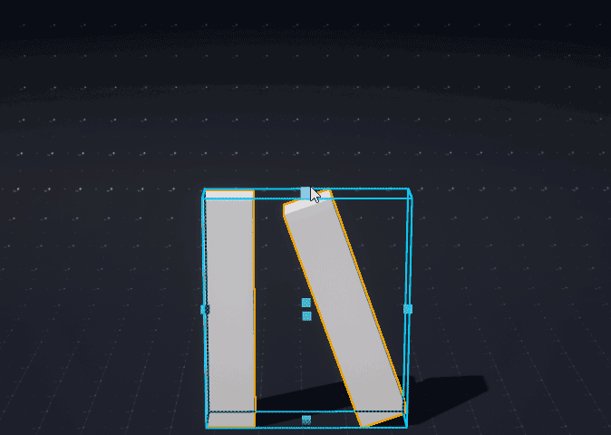
> 

>
> - #### Local/World aligment
> If several objects are rotated the same way or in 90 degree increments, the Scale Bouding Box is oriented locally. 
> If several objects are rotated differently, the Scale Bounding Box has a world orientation
>
> 

>   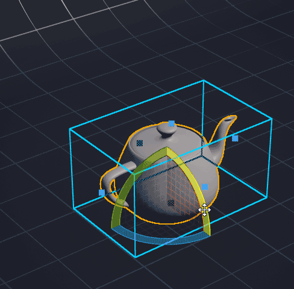
>   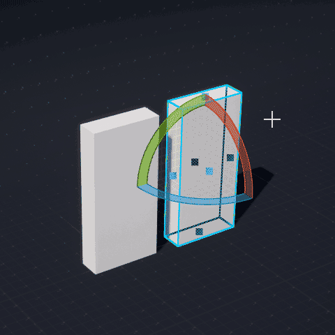
> 

 

### 9. Limitations
> - #### Blueprint Support
> Version 1.01 does not support scaling inside BP
>
> - #### Blueprint Scaling
> Blueprint in the scene does not support correct scaling if components are rotated relative to each other. Components will be scaled along local axes. Uniform BP scaling works as expected
>
> - #### Level Instance Scaling
> LI in the scene does not support correct scaling if components are rotated relative to each other. Components will be scaled along local axes.
> Uniform LI scaling works as expected. Inside LI objects are scaled the same as several other objects in the scene
>
</blockquote>

## ◆ `Plugins Settings`

> Go to the `Editor Preference/Plugins/Advanced Scale`

> ### 1. Appearance
> - Edge Color — Changes the color of the bounding frame
> - Face Handle Color — Changes the color of the handles located at the center of each face
> - Corner Handle Color — Changes the color of the two-axis corner handles
> - Box Corner Handle Color — Changes the color of the three-axis handles located at the actual corners of the box
>
> ### 2. Viewport Menu Settings
> - Bottom Offset (px) — Sets the distance between the bottom of the viewport and the Advanced Scale menu
> - Show Modifier Hints — Shows or hides the keyboard shortcut reminder at the bottom of the viewport: `Ctrl — Corner Handles, Shift — Uniform Scale, Alt — Mirror Scale`
>
> ### 3. Point Handles
> - Interaction Radius (px) — Sets how close the mouse cursor must be to a point handle for it to react. This value is measured in screen pixels
>
> ### 4. Vertex Snapping
> - Search Radius — Sets the maximum world-space distance around the current mouse position in which vertex snap candidates are searched while holding `V`
> - Screen Snap Radius (px) — Sets how close a vertex must appear to the cursor on screen before it can be selected as a snap target
>
> ### 5. Flat Mode
> - Flat Mode Threshold — Determines when a thin object is treated as flat. The value is relative to its other dimensions: for example, 0.05 means 5%
